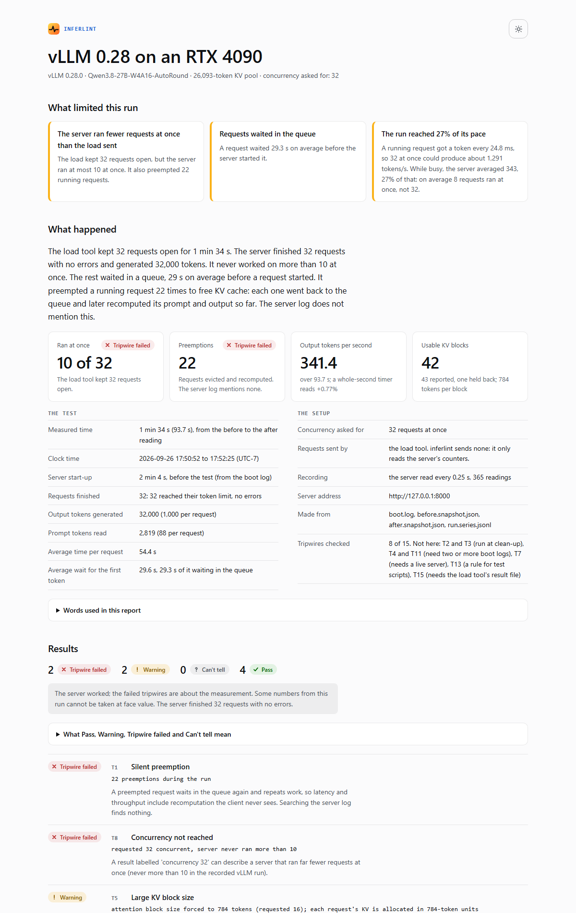

# inferlint

**Things your inference server doesn't tell you, turned into checks.**

Serving benchmarks fail quietly. vLLM preempts requests and logs nothing. A config boots
cleanly and dies on its first request. The KV pool you measured yesterday is not the one
you got today. A cleanup script stops the API server and leaves the engine holding the
GPU. None of these raise an error, and all of them change the numbers.

`inferlint` turns each one into a check: a tripwire that stays quiet until a run crosses
it. Run them in CI, in a campaign script or by hand.

## One run, measured

vLLM 0.28 on an RTX 4090, a 27B hybrid attention/Mamba model with 4-bit weights and
CUDA graphs on. 32 concurrent requests, 1,000 output tokens each:

```console
$ inferlint preemption before.json after.json
[ T1] FAIL  22 preemptions during the run
$ grep -ci preempt boot.log
0
$ inferlint series run.series.jsonl --snapshot after.json --requested 32
[T14] PASS  gauge denominator is 42 = num_gpu_blocks (43) - 1 null block
[ T9] WARN  ceiling moved between 7 and 10 as requests grew (one request held 9.5% to 14.3% of the cache); concurrency was not a constant of this run
[ T8] FAIL  requested 32 concurrent, server never ran more than 10
```

- The client held 32 requests in flight. The server never ran more than 10 at once.
- A fresh request held 4 KV blocks, so 10 fit. As outputs crossed the 784-token block
  boundary, requests grew to 6 blocks and the ceiling fell to 7. Each fall evicted
  running requests, 22 times in all, and the server log says nothing about it.
- The server exports 43 KV blocks, but the usage gauge counts in 42nds. One block is
  reserved and never holds a request.

Then the API server was killed with SIGKILL, as a crash or the OOM killer would:

```console
$ pkill -9 -f "vllm[ ]serve"; sleep 20
$ ps -eo pid,ppid,rss,args | grep -E "[V]LLM::|[v]llm serve"
   1030     423 2733144 VLLM::EngineCore
$ inferlint gpu-clear
[ T2] FAIL  card not clear; refusing to boot. ... 21768 MiB used, 1 server processes alive
$ inferlint teardown
target  pid=1030     VLLM::EngineCore
(pkill -f 'vllm serve' would miss 1 and wrongly hit 0)
[ T2] PASS  2 consecutive clear readings
```

The engine outlived its parent and kept 21.3 GiB of the card. The usual cleanup pattern
cannot see it, and the next boot would have loaded a second copy into what was left.
The raw files from this run are in [`tests/fixtures/vllm-0.28/live/`](tests/fixtures/vllm-0.28/live/),
and `tests/test_live.py` pins every number above.

## What it checks

| id | trap | command |
|---|---|---|
| T1 | preemption is silent: a counter moves, no log line is written | `inferlint preemption BEFORE AFTER` |
| T2 | `pkill -f "vllm serve"` misses the renamed `VLLM::EngineCore` | `inferlint teardown`, `inferlint gpu-clear` |
| T3 | `pkill -f` in a shell one-liner kills the shell | `inferlint teardown` |
| T4 | the KV pool is drawn per boot, in discrete levels | `inferlint check-log BOOT...` |
| T5 | hybrid models force a large attention block (the allocation unit) | `inferlint check-log` |
| T6 | the requested attention backend is not applied to the speculative drafter | `inferlint check-log` |
| T7 | a config boots, then dies on its first request | `inferlint probe URL` |
| T8 | requested concurrency is not achieved concurrency | `inferlint series --requested N` |
| T9 | the concurrency ceiling is `floor(1 / share)`, and it falls as requests grow | `inferlint series` |
| T10 | integer-second timers are worth several percent | `inferlint rate BEFORE AFTER` |
| T11 | KV memory differs between boots of one config | `inferlint check-log BOOT...` |
| T12 | boot failures recorded without a reason | `inferlint check-log` |
| T13 | a killed campaign's waiter adopts the next server | [docs/orchestration.md](docs/orchestration.md) |
| T14 | the KV usage gauge's denominator is `num_gpu_blocks - 1` | `inferlint series --snapshot` |

Each is described in [docs/tripwires.md](docs/tripwires.md) with its symptom, why it
changes results, and a command that reproduces it from files in this repository.

## Install

```console
pip install inferlint   # not yet published; for now: pip install -e .
```

Python 3.10+, no dependencies. Teardown reads `/proc` and `nvidia-smi`, so it is
Linux-only, like vLLM. Everything else runs anywhere.

## Use

```bash
inferlint gpu-clear || exit 1                 # refuse to boot on a dirty card
vllm serve "$MODEL" ... > boot.log 2>&1 &
# ... wait for "Application startup complete" ...
inferlint check-log boot.log                  # backend, block size, failure reason
inferlint probe http://127.0.0.1:8000         # a boot is not a gate

inferlint snapshot http://127.0.0.1:8000 -o before.json
inferlint watch http://127.0.0.1:8000 -o run.series.jsonl &
# ... run the benchmark ...
inferlint snapshot http://127.0.0.1:8000 -o after.json
kill %2

inferlint preemption before.json after.json   # T1
inferlint rate before.json after.json         # T10
inferlint series run.series.jsonl --snapshot after.json --requested 32   # T8 T9 T14
inferlint teardown                            # T2
```

### The report

`inferlint report` turns a run's files into one HTML page. It opens with a plain-English
account of what happened (how long the test ran, requests finished and failed, tokens
generated, time spent queued, which tripwires were checked and which need other
files), then the verdicts, charts of what the server did over time, the boot facts, and
a guide to every tripwire. Two collapsible glossaries explain the terms (token, KV
pool, block, preemption) and what Pass, Warning, Fail and Can't tell mean: a Fail is a
finding about the measurement, not a crash, except for T7 and T12.

The page fetches nothing, so it opens offline and can be attached to a ticket as it is.
It has a light/dark switch, every chart has a data table, and hovering (or the arrow
keys) reads values at any moment.

```bash
inferlint report -o run.html --boot-log boot.log --before before.json --after after.json \
    --series run.series.jsonl --requested 32
```



**See a full example.** [`docs/example-report.html`](docs/example-report.html) is the complete
report for the run above: the charts, the findings and both glossaries. GitHub shows HTML files
as source code, so open the file, choose **Download raw file**, and open it in any browser. It
works offline.

**Try it without a GPU.** The example is built from the recorded run in this repository, so you
can make it yourself right after installing:

```bash
inferlint report -o example-report.html --title "vLLM 0.28 on an RTX 4090" --requested 32 \
    --boot-log tests/fixtures/vllm-0.28/live/boot.log \
    --before tests/fixtures/vllm-0.28/live/before.snapshot.json \
    --after tests/fixtures/vllm-0.28/live/after.snapshot.json \
    --series tests/fixtures/vllm-0.28/live/run.series.jsonl
```

`inferlint explain T9` prints the same plain-English explanation in the terminal.

Exit status is 0 when every check passes (warnings allowed), 1 when one fails, and 2
when one cannot decide because a series or a log line was missing. A missing series
is never read as zero. `--json` gives machine-readable results; `--strict` fails on
warnings.

From Python:

```python
from inferlint import bootlog, checks, telemetry

before = telemetry.scrape("http://127.0.0.1:8000")
...  # run
after = telemetry.scrape("http://127.0.0.1:8000")
checks.check_no_preemption(before, after).raise_for_status()

facts = bootlog.parse_file("boot.log")
result["boot"] = facts.result_block()   # pool, block size, backend: stamp every result
```

## How it is tested

- **Real evidence.** Fixtures are vLLM 0.28 boot logs and `/metrics` output from an
  RTX 4090, with paths removed. Each check is tested against the case it exists for.
- **Every check is watched failing.** `tests/test_mutations.py` changes one number or
  line in real evidence and requires the verdict to flip. A check never seen to fail is
  of unknown value.
- **Instruments against ground truth.** The probe runs against a mock server with known
  failure modes. Block-count inference (T14) is checked against the count the server
  exports. The teardown's process matching runs on a synthetic `/proc` that includes the
  shell one-liner and a bystander.
- **Unknown formats are reported, not defaulted.** When a known log line changes format
  in a new vLLM release, `boot-facts` lists it as unparsed instead of returning a value.

## Status

In development, not yet released. Every tripwire is tested against recorded vLLM 0.28
evidence. T1, T2, T5, T8, T9, T10 and T14 have also been re-measured by this code on a
live vLLM 0.28 server. Re-verification on the current vLLM release and support for the
llama.cpp `/metrics` subset come next.

## About

`inferlint` is made by [RadianVector](https://radianvector.com). RadianVector develops
tools and research for evaluating and improving AI systems.

## License

Copyright 2026 RadianVector.

This project, including the recorded evidence in `tests/fixtures/`, is licensed under the
Apache License, Version 2.0. See [LICENSE](LICENSE) for details.
